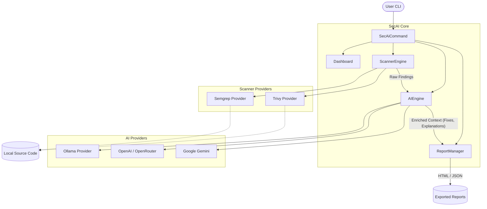

# Welcome to SecAI 🛡️

**SecAI** is an intelligent, cross-platform security analysis CLI. It elevates standard security scanners (like Semgrep and Trivy) by enriching their raw findings with AI-generated explanations, concrete attack scenarios, precise remediation steps, and secure code examples. 

Whether you're a developer trying to quickly patch a vulnerability or a security engineer triaging a repository, SecAI acts as your personal application security assistant.

## About the Project

SecAI is built entirely as an **Open Source** tool. We believe that robust security tooling should be accessible, transparent, and community-driven. 

- **Provider Agnostic**: Bring your own AI. We support **OpenAI**, **Gemini**, **OpenRouter**, and local open-source models via **Ollama** out of the box!
- **Interactive Dashboard**: Running `secai` acts as a dynamic dashboard that checks your system dependencies and AI configuration.
- **Privacy First**: Because it supports Ollama, you can run powerful 120B+ parameter models completely locally without ever sending proprietary code off your machine.

## Installation & Requirements

### Option 1: Direct Native Installation (Recommended)
SecAI distributes pre-compiled native binaries using GraalVM. You do **not** need Java installed to run it!

**Linux & macOS:**
```bash
curl -sSL https://raw.githubusercontent.com/REACH-ARC/SecAI/main/install.sh | bash
```

**Windows (PowerShell):**
```powershell
irm https://raw.githubusercontent.com/REACH-ARC/SecAI/main/install.ps1 | iex
```

### Option 2: Clone & Run (For Development)
If you want to run it from source, ensure you have Java 21+ installed.
```bash
git clone https://github.com/REACH-ARC/SecAI.git
cd SecAI
./mvnw clean package -DskipTests
java -jar target/secai-0.0.1-SNAPSHOT.jar
```

### Requirements (Scanners)
SecAI orchestrates underlying scanners. They must be installed in your system `PATH`:
- **Semgrep** (`pip install semgrep` or `brew install semgrep`)
- **Trivy** (`apt-get install trivy`, `brew install trivy`, or `winget install Aquasecurity.Trivy`)

*Note: If you run `secai` directly, the interactive dashboard will automatically tell you if these are missing and provide exact copy-paste installation commands for your OS.*

## Architecture



## Feature Plan (Roadmap)

We are constantly improving SecAI. Here is our high-level roadmap:

- [x] **Core Scanning**: Integration with Semgrep and Trivy.
- [x] **AI Enrichment**: Multi-provider support (Ollama, OpenAI, Gemini).
- [x] **Dashboard Experience**: Interactive CLI entrypoint.
- [x] **Custom URL Overrides**: Support for OpenRouter and custom OpenAI-compatible endpoints.
- [ ] **Automated Remediation**: Enhance `secai fix --apply` to gracefully apply multi-file patches via AST manipulation instead of just inline text replacement.
- [ ] **CI/CD Integration**: Native GitHub Actions and GitLab CI templates for blocking builds on critical vulnerabilities.
- [ ] **Expanded Scanners**: Add support for Bandit (Python), Gitleaks (Secrets), and Checkov (IaC).
- [ ] **Vector Memory**: Give the AI context of previous scans and fixes across the repository using a local vector database.
