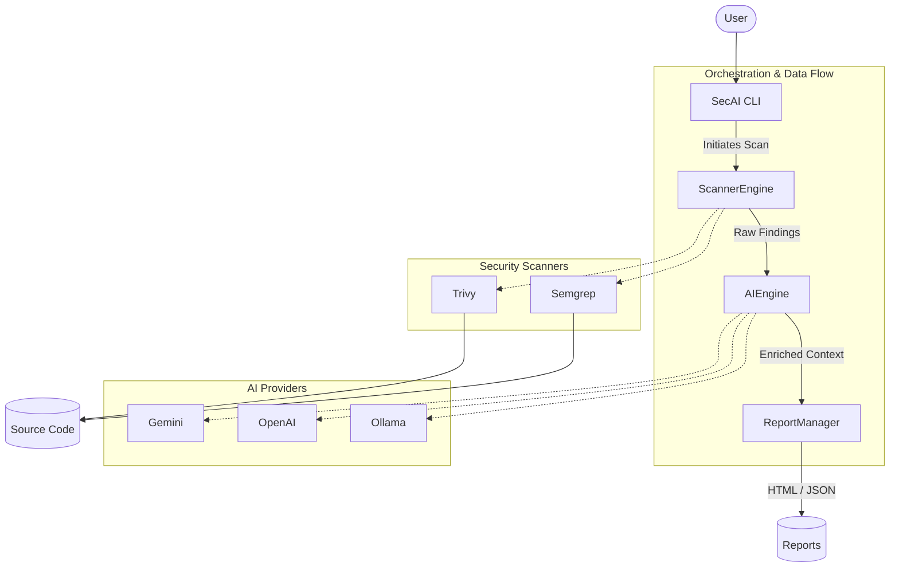

# Welcome to SecAI 🛡️

**SecAI** is an intelligent, cross-platform security analysis CLI. It elevates standard security scanners (like Semgrep and Trivy) by enriching their raw findings with AI-generated explanations, concrete attack scenarios, precise remediation steps, and secure code examples. 

Whether you're a developer trying to quickly patch a vulnerability or a security engineer triaging a repository, SecAI acts as your personal application security assistant.

## About the Project

SecAI is built entirely as an **Open Source** tool. We believe that robust security tooling should be accessible, transparent, and community-driven. 

- **Provider Agnostic**: Bring your own AI. We support **OpenAI**, **Gemini**, **OpenRouter**, and local open-source models via **Ollama** out of the box!
- **Interactive Dashboard**: Running `secai` acts as a dynamic dashboard that checks your system dependencies and AI configuration.
- **Privacy First**: Because it supports Ollama, you can run powerful 120B+ parameter models completely locally without ever sending proprietary code off your machine.

## Installation & Requirements

### Option 1: Direct Native Installation (Recommended)
SecAI distributes pre-compiled native binaries using GraalVM. You do **not** need Java installed to run it!

**Linux & macOS:**
```bash
curl -sSL https://raw.githubusercontent.com/SecAI-Cam/SecAI/main/install.sh | bash
```

**Windows (PowerShell):**
```powershell
irm https://raw.githubusercontent.com/SecAI-Cam/SecAI/main/install.ps1 | iex
```

### Option 2: Clone & Run (For Development)
If you want to run it from source, ensure you have Java 21+ installed.
```bash
git clone https://github.com/SecAI-Cam/SecAI.git
cd SecAI
./mvnw clean package -DskipTests
java -jar target/secai-0.0.1-SNAPSHOT.jar
```

### Requirements (Scanners)
SecAI orchestrates underlying scanners. They must be installed in your system `PATH`:
- **Semgrep** (`pip install semgrep` or `brew install semgrep`)
- **Trivy** (`apt-get install trivy`, `brew install trivy`, or `winget install Aquasecurity.Trivy`)

*Note: If you run `secai` directly, the interactive dashboard will automatically tell you if these are missing and provide exact copy-paste installation commands for your OS.*

### Troubleshooting: Windows PATH Limit
If you try to manually add these scanners to your Windows Environment Variables and encounter a *"This environment variable is too large (2047 characters)"* error, you can easily bypass the GUI limit using PowerShell. Open PowerShell as an Administrator and run:

```powershell
[Environment]::SetEnvironmentVariable("PATH", $env:PATH + ";C:\Your\New\Folder\Path", [EnvironmentVariableTarget]::Machine)
```
*(Make sure to replace `C:\Your\New\Folder\Path` with the actual folder path containing the scanner executable).*

## Architecture


## V2 Feature: Autonomous Pentest Verification

SecAI v2 introduces a Human-in-the-Loop Dynamic Application Security Testing (DAST) engine. 

1. **Scan:** Run `secai scan .` to find static vulnerabilities.
2. **Verify:** Run `secai verify http://localhost:8080` to dynamically verify them.

The AI will generate a verification plan using tools like Nmap, Nuclei, SQLMap, Nikto, and Metasploit. You must review and approve the plan. SecAI then executes the tools inside an isolated Kali Linux Docker sandbox, preventing host system modification.

```bash
# First time setup (builds the Kali Docker image)
secai verify --setup

# Generate a plan without executing
secai verify http://target.com --plan-only

# Run full verification
secai verify http://target.com
```

## Features

- **Multi-Scanner Architecture**: Seamlessly aggregates findings from industry-standard tools like Semgrep and Trivy.
- **Provider Agnostic AI**: Bring your own AI! Supports **OpenAI**, **Gemini**, **OpenRouter**, and **Ollama** natively.
- **Interactive Dashboard**: Running `secai` checks your system health, verifies scanner dependencies, and guides you through setup.
- **Claude Code-Style Auto-Fix**: Automatically slices vulnerable code contexts, queries the AI for a patch, and interactively applies inline diffs (`[-]:` / `[+]:`) directly to your codebase.
- **Contextual Memory**: Maintain an interactive chat session with the AI about specific vulnerabilities in your terminal.
- **Premium Reporting**: Export findings into shareable Markdown or stunning HTML formats.

## Usage

### 1. Configuration
SecAI can be configured quickly via the CLI:
```bash
# Use local Ollama
secai config --provider ollama --url http://127.0.0.1:11434 --model llama3

# Or use OpenAI / OpenRouter
secai config --provider openai --api-key "YOUR_KEY" --model "gpt-4o"
```

### 2. Available Commands
- `secai scan .` : Scan the current directory for vulnerabilities.
- `secai explain <id>` : Get an AI explanation of a specific finding (e.g., `secai explain 53`).
- `secai fix <id>` : Generate an AI remediation and interactively apply the patch to your source code.
- `secai chat` : Chat interactively with the AI assistant about your project's security context.
- `secai report --format html` : Generate a visual HTML security report.
- `secai doctor` : Diagnose system health and tools.
- `secai update` : Update the internal vulnerability databases and signatures of the underlying scanners.

## Feature Plan (Roadmap)

We are constantly improving SecAI. Here is our high-level roadmap:

- [x] **Core Scanning**: Integration with Semgrep and Trivy.
- [x] **AI Enrichment**: Multi-provider support (Ollama, OpenAI, Gemini).
- [x] **Dashboard Experience**: Interactive CLI entrypoint.
- [x] **Custom URL Overrides**: Support for OpenRouter and custom OpenAI-compatible endpoints.
- [ ] **Automated Remediation**: Enhance `secai fix --apply` to gracefully apply multi-file patches via AST manipulation instead of just inline text replacement.
- [ ] **CI/CD Integration**: Native GitHub Actions and GitLab CI templates for blocking builds on critical vulnerabilities.
- [ ] **Expanded Scanners**: Add support for Bandit (Python), Gitleaks (Secrets), and Checkov (IaC).
- [ ] **Vector Memory**: Give the AI context of previous scans and fixes across the repository using a local vector database.
