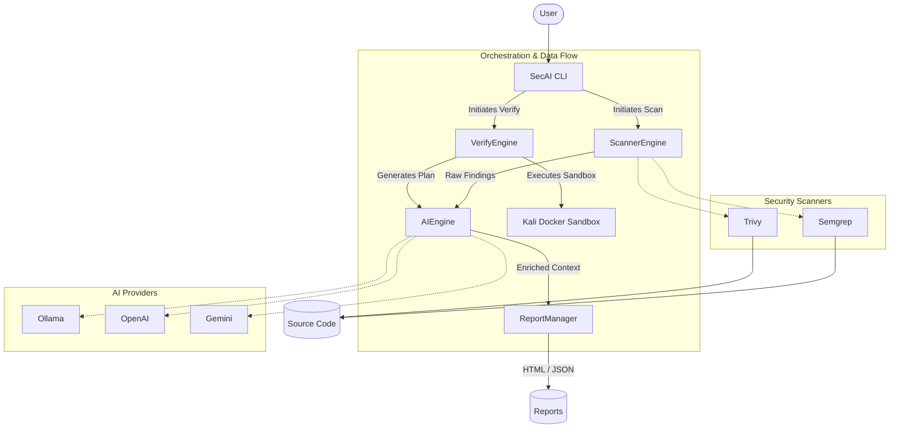

# Welcome to SecAI 🛡️

**SecAI** is an intelligent, cross-platform security analysis CLI. It elevates standard security scanners (like Semgrep and Trivy) by enriching their raw findings with AI-generated explanations, concrete attack scenarios, precise remediation steps, and secure code examples. 

Whether you're a developer trying to quickly patch a vulnerability or a security engineer triaging a repository, SecAI acts as your personal application security assistant.

## About the Project

SecAI is built entirely as an **Open Source** tool. We believe that robust security tooling should be accessible, transparent, and community-driven. 

- **Provider Agnostic**: Bring your own AI. We support **OpenAI**, **Gemini**, **OpenRouter**, and local open-source models via **Ollama** out of the box!
- **Interactive Dashboard**: Running `secai` acts as a dynamic dashboard that checks your system dependencies and AI configuration.
- **Privacy First**: Because it supports Ollama, you can run powerful 120B+ parameter models completely locally without ever sending proprietary code off your machine.

## Installation & Requirements

### Option 1: Direct Native Installation (Recommended)
SecAI distributes pre-compiled native binaries using GraalVM. You do **not** need Java installed to run it!

**Linux & macOS:**
```bash
curl -sSL https://raw.githubusercontent.com/SecAI-Cam/SecAI/main/install.sh | bash
```

**Windows (PowerShell):**
```powershell
irm https://raw.githubusercontent.com/SecAI-Cam/SecAI/main/install.ps1 | iex
```

### Option 2: Clone & Run (For Development)
If you want to run it from source, ensure you have Java 21+ installed.
```bash
git clone https://github.com/SecAI-Cam/SecAI.git
cd SecAI
./mvnw clean package -DskipTests
java -jar target/secai-0.0.1-SNAPSHOT.jar
```

### Requirements (Scanners & Sandbox)
SecAI orchestrates underlying tools. Ensure the following are installed:
- **Semgrep** (`pip install semgrep` or `brew install semgrep`)
- **Trivy** (`apt-get install trivy`, `brew install trivy`, or `winget install Aquasecurity.Trivy`)
- **Docker** (Required **only** for the `secai verify` Pentest Sandbox)

*Note: If you run `secai` directly, the interactive dashboard will automatically tell you if these are missing and provide exact copy-paste installation commands for your OS.*

## Architecture



## Step-by-Step Guide

### 1. Configure the AI (`secai config`)
Before scanning, you must connect SecAI to an AI provider. You can use local models (Ollama) or cloud providers (OpenAI, Gemini, OpenRouter).

```bash
# Connect to OpenAI
secai config --provider openai --api-key "YOUR_KEY" --model "gpt-4o"

# Connect to Google Gemini
secai config --provider gemini --api-key "YOUR_KEY" --model "gemini-2.5-pro"

# Use local, private AI with Ollama
secai config --provider ollama --url http://127.0.0.1:11434 --model llama3
```
*Note: Your configuration is saved locally to your project in `secai.yml`.*

### 2. Scan your Project (`secai scan`)
Run a static analysis scan to discover code vulnerabilities and misconfigurations.
```bash
secai scan .
```
This runs Semgrep and Trivy against your current directory, aggregating the results into a unified report.

### 3. Review Findings (`secai list`)
List all vulnerabilities discovered during the most recent scan.
```bash
secai list
```
Each finding is given a unique ID (e.g., `1`, `2`, `3`) which you will use in subsequent commands.

### 4. AI Explanation (`secai explain <id>`)
Get an in-depth AI breakdown of a specific vulnerability.
```bash
secai explain 1
```
The AI will read the vulnerable file, explain the attack vector, and discuss why it is dangerous in your specific context.

### 5. AI Remediation (`secai fix <id>`)
Automatically generate a patch for the vulnerability.
```bash
secai fix 1
```
SecAI will use Claude Code-Style Auto-Fix logic to determine the exact lines of code that need changing, and will interactively ask you to apply the patch directly to your file.

### 6. Dynamic Pentesting (`secai verify <url>`)
*Requires Docker.* SecAI v2 introduces a Human-in-the-Loop Dynamic Application Security Testing (DAST) engine. Instead of just static analysis, SecAI can autonomously attack the running target to verify if the static findings are actually exploitable.

**Step A: Setup the Sandbox**
Builds an isolated Kali Linux Docker container pre-loaded with security tools (Nmap, ffuf, SQLMap, Nuclei, Metasploit).
```bash
secai verify --setup
```

**Step B: Plan Verification (Optional)**
Generate an AI-driven attack plan based on your static findings without executing it.
```bash
secai verify http://localhost:8080 --plan-only
```

**Step C: Execute Pentest**
Launch the Agentic Pentest Engine. The AI will dynamically analyze your findings, formulate a plan, and execute tools within the Sandbox. The AI iteratively analyzes the output of each tool (e.g., parsing open ports from `nmap` to feed into `ffuf`) until it proves or disproves the vulnerability.
```bash
secai verify http://localhost:8080
```

### 7. Interactive Security Chat (`secai chat`)
Maintain a conversational session with the AI about your repository. The AI retains context of your scan results and codebase.
```bash
secai chat
```

### 8. Generate Reports (`secai report`)
Export your findings into professional HTML or Markdown reports for stakeholders.
```bash
secai report --format html
```

### 9. Maintenance (`secai doctor` & `secai update`)
- `secai doctor`: Diagnose system health, check AI connectivity, and verify scanner installations.
- `secai update`: Update the internal vulnerability databases (e.g., Trivy definitions) to ensure you detect the latest CVEs.

## Feature Plan (Roadmap)

We are constantly improving SecAI. Here is our high-level roadmap:

- [x] **Core Scanning**: Integration with Semgrep and Trivy.
- [x] **AI Enrichment**: Multi-provider support (Ollama, OpenAI, Gemini).
- [x] **Dashboard Experience**: Interactive CLI entrypoint.
- [x] **Agentic Verification**: Autonomous AI Pentest Engine utilizing isolated Kali Linux Sandboxes.
- [x] **Context Optimization**: Summarizer Sub-Agents and RAG-based context slicing for handling massive tool outputs.
- [ ] **Automated Remediation**: Enhance `secai fix` to gracefully apply multi-file patches via AST manipulation.
- [ ] **CI/CD Integration**: Native GitHub Actions and GitLab CI templates for blocking builds.
- [ ] **Expanded Scanners**: Add support for Bandit (Python), Gitleaks (Secrets), and Checkov (IaC).
- [ ] **Vector Memory**: Give the AI context of previous scans and fixes across the repository using a local vector database.
